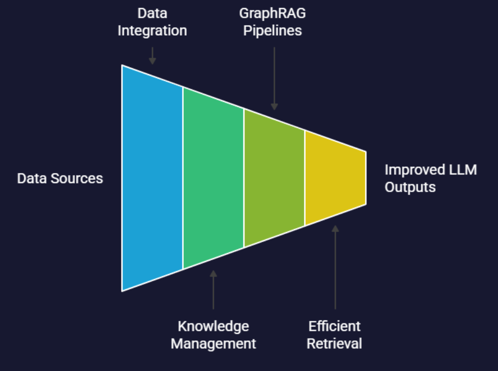
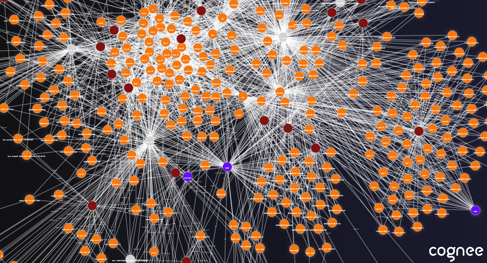

# Dlt + Cognee Workshop

## Dlt

*dlt* (data loading tool) is an open-source library in Python that helps implement ETL data pipelines, especially when it comes to managing **schemas**, **state** and **incremental loading**.

- **ETL**: Extract, Transform/Normalize, Load.

> It supports many sources and destionations, but can be used even for very specific use cases.

## Cognee

Cognee turns data sources into an in-memory **knowledge graph** that can be queried as part of a **context-aware** RAG pipeline.

It works with both **structured** and **unstructured** data. Besides vectorizing the data just like vector databases do, it creates **semantic relationships between data-points**.

### Process

A Cognee pipeline usually has the following steps:

1. Parsing data from documents, dataframes, etc.
2. Building the knowledge graph, identifying entities and relantionships.
3. Adding contextual data.
4. Storing the enriched data for future queries.

### How It Approaches RAG Challenges

- **Retrieval Quality & Relevance** `->` Semantic graphs to connect relevant facts.
- **Ranking** `->` Graph traversal to consolidate information.
- **Scalability** `->` dlt and LanceDB (vector DB) integrations. Easily switching local and cloud environments.

### Node Sets

Node Sets are **tags** that are applied to nodes for better organization and topic filtering when performing searches. Supported by:

- Neo4j
- Kuzu

### Demo 1 - NYC Taxi Dataset GraphRAG

Check out the demo on [Google Colab](https://colab.research.google.com/drive/19LiPZ0eNKxbQGha-DChQCz1GStkg0pSD?authuser=1#scrollTo=RRtqeThCjfsc) to see how to use Cognee with Mistral's models and embeddings to create a basic RAG knowldge graph from the NYC Taxi dataset. Ingestion is performed using dlt.

### Demo 2 - API Docs GraphRAG
This is a local demo for ingesting API docs with dlt, using an ontology to define the main semantic entities (pagination, authentication, etc.) and creating the knowledge graph.

Check `filesystem_pipeline.py`, `mount_cognee.py` and `search_knowledge_graph.ipynb`.

